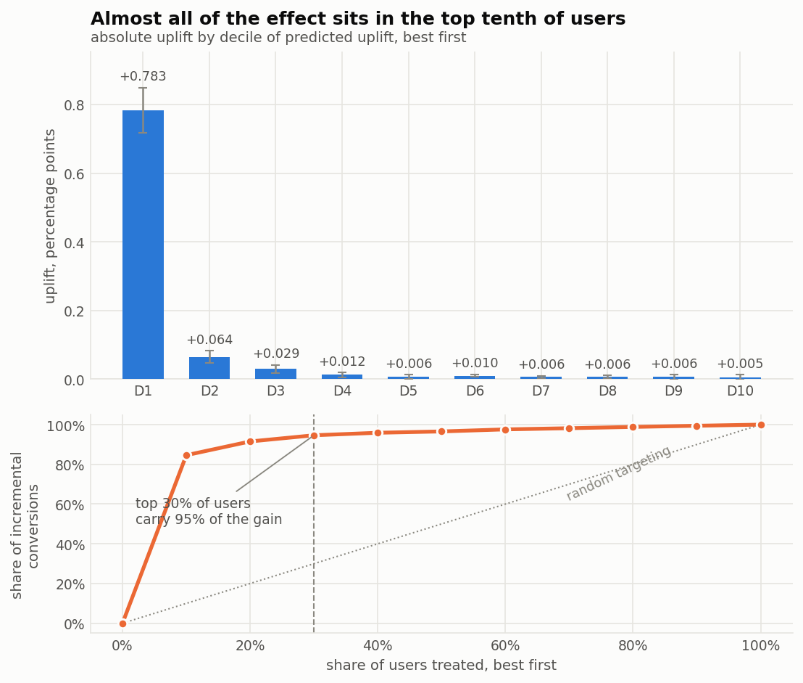
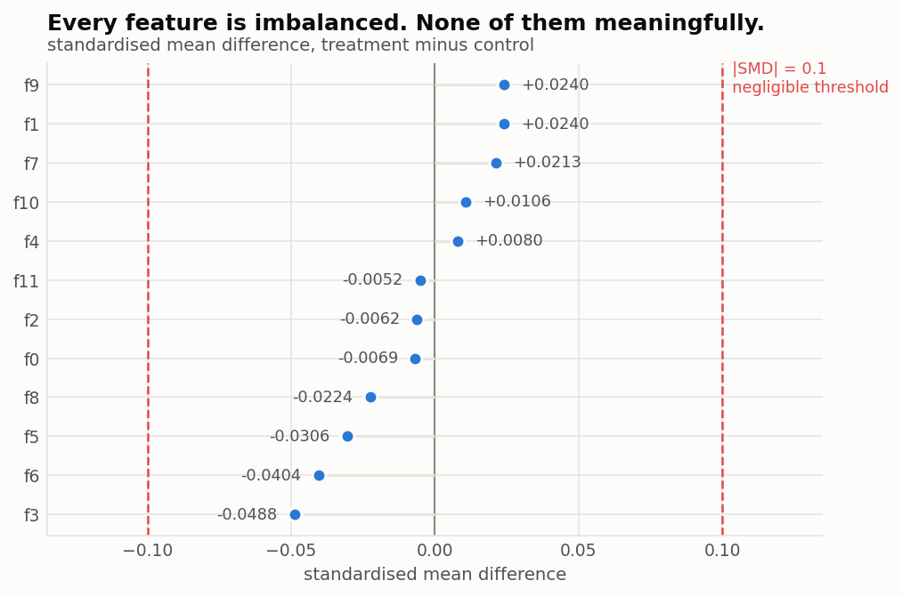
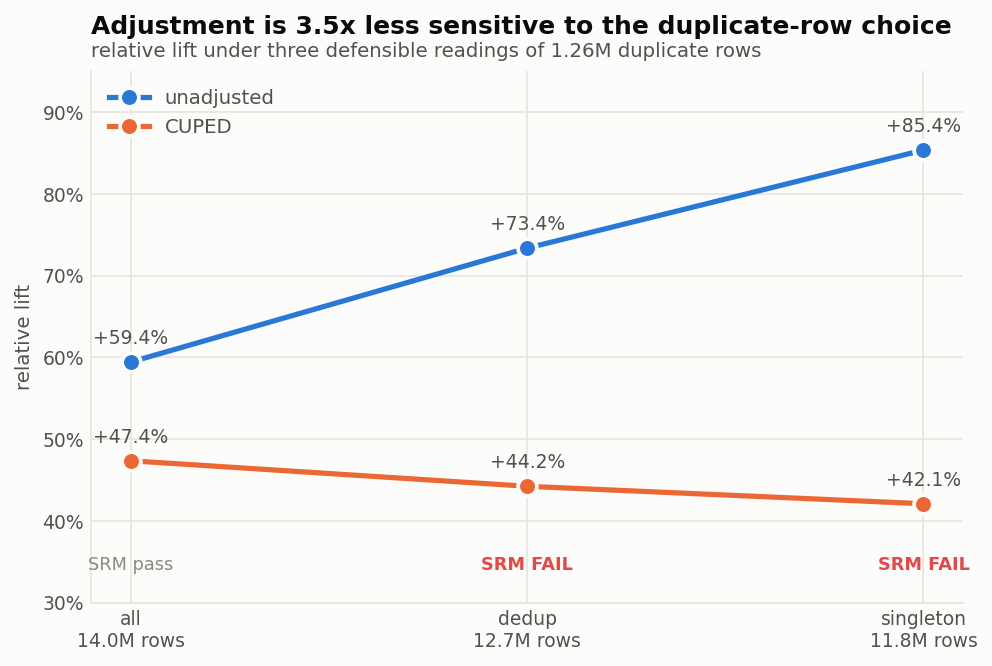
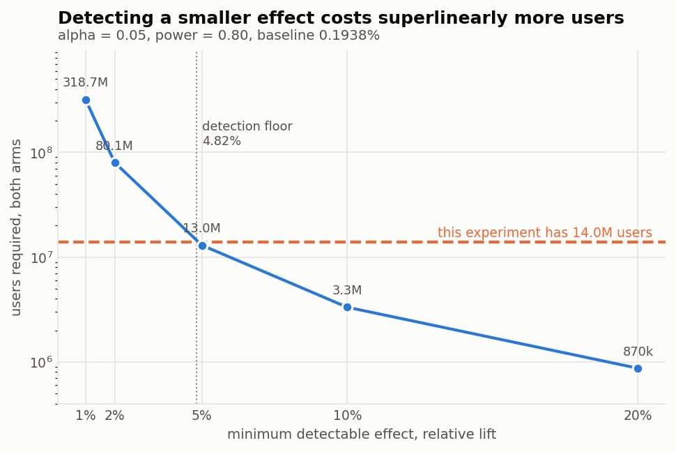
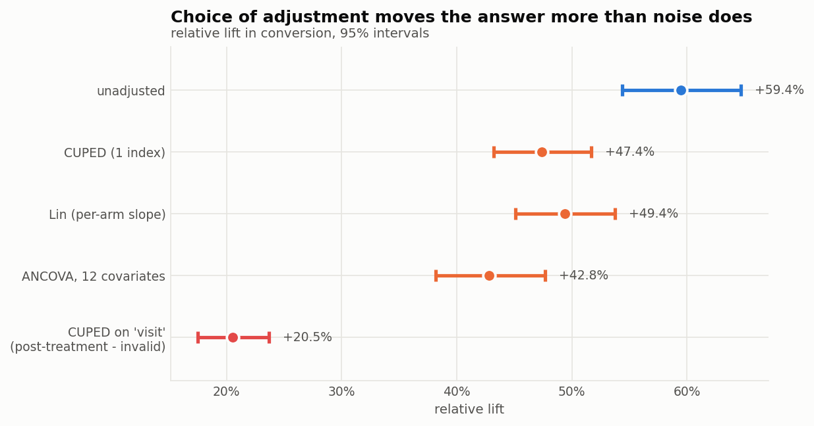

# GroundTruth

Experimentation analysis on the Criteo Uplift log: 13,979,592 rows through
Spark, six validity checks, and a ship/no-ship recommendation with the
caveats attached. Full run takes about 80 seconds on a laptop.

```bash
bash scripts/get_data.sh          # 311 MB download
python -m src.run                 # everything
python -m src.run --fast          # skip the two extra Spark passes
python -m pytest tests/ -q        # 28 tests
```

Every number here comes from `results/summary.json`, written by that run.

---

## The recommendation

**Ship it, and target it.**

Conversion rises 47.4% in relative terms (95% CI +43.2% to +51.7%). The bar I
set for "worth shipping" is a 10% relative lift; the weakest lower bound across
every specification I tried is +38.6%, so the decision holds however the data
is handled.

Then targeting, which is where the money is. 95% of the incremental conversions
come from the top 30% of users by predicted uplift. Roughly 70% of the ad spend
could go without losing much.



**What would change my mind.** This log is not a clean randomised experiment
and should not be presented as one. The 85/15 split is constructed rather than
randomised, the arms differ on every observed pre-assignment feature, and the
measured magnitude moves by a factor of two depending on how you treat 1.26
million duplicate rows. The direction and the ship decision survive all of
that. The precise number does not, and no adjustment fixes imbalance on
features nobody recorded.

| | |
|---|---|
| leading estimate | +47.4% relative (CUPED-adjusted) |
| across all specifications | +42.1% to +85.4% |
| bar to clear | +10% relative (stated assumption, not a measured break-even) |
| worst-case lower bound | +38.6% |
| effect among users actually shown an ad | +2.73 pp |
| Qini coefficient | 0.814 |

---

## The guardrails, and what each one catches

Six checks run before any effect is computed. They catch different failures,
and on this dataset three of them fire.

| check | asks | result here |
|---|---|---|
| SRM | do the arms have the right *number* of users? | pass, suspiciously well |
| under-dispersion | is the split *too* close to design? | **fires** — ratio is exactly 17:3 |
| row-order | is assignment correlated with position in the file? | **fires** — 13% to 100% by block |
| balance | do the arms hold the same *kind* of user? | **fires** — all 12 features differ |
| specification curve | does the answer depend on a cleaning choice? | **fires** — 1.44x spread |
| peeking | would early looks have inflated the error rate? | 28.8% at 30 looks |

### SRM passes, and that is the problem

The split is 85.00/15.00, off by 2 users out of 13,979,592. Chi-square p =
0.9989.

A chi-square p-value is uniform under the null, so p = 0.9989 is exactly as
improbable as p = 0.0011. One standard deviation of binomial noise here is
1,335 users and the arms sit 0.0013 sd apart — random assignment lands that
close 0.11% of the time.

The arm ratio settles it: 5.66667239 against 17/3 = 5.66666667, agreeing to
seven significant figures. Nothing random produces that. Control was
downsampled to hit exactly 15%.

So the check reports under-dispersion next to the pass. A bare green tick would
imply this validates Criteo's randomiser when it only shows the guardrail runs.

The stage also tests the same counts against other assumed designs, because
that assumption is the entire test:

| assumed share | chi² | p | |
|---|---|---|---|
| 50% | 6,850,005 | 0 | fail |
| 84% | 10,402 | 0 | fail |
| **85%** | **0.0** | **0.999** | **pass** |
| 86% | 11,611 | 0 | fail |

Test an 85/15 experiment against a 50/50 default and a healthy experiment looks
catastrophic. The expected ratio has to come from the design document.

### The file is not shuffled

Treatment share by position, in tenths of the file:

```
100% 100% 100% 99% 13% 87% 91% 80% 97% 82%
```

The first 35% of rows are entirely treatment. So is the last 5%. Any sample
taken with `head`, `LIMIT`, or a positional train/test split contains one arm.
A test in this repo hit exactly that and produced a sample with no control
users in it, which is how the check got written.

### Counts pass. Composition does not.

SRM validates how many users are in each arm. It says nothing about whether
they are the same kind of user.



All twelve pre-assignment features differ at overwhelming significance —
Hotelling F(12, 13,979,579) = 428.6, p = 0, f3 at z = −67 — while every
standardised mean difference sits under 0.05, half the conventional 0.1
threshold. Statistically undeniable, practically trivial by normal standards,
and still material because the effect is small: the adjustment term is
θ × imbalance = 0.000168, which is 14.6% of a 0.00115 effect.

Chance imbalance alone would move the estimate 1.19%. It moved 14.61%. That
ratio, 12.3x, is what distinguishes a real problem from noise.

### The duplicate rows decide the answer

2,221,150 rows sit in groups of byte-identical duplicates and there is no user
ID to tell you whether that means one user logged twice or two users who look
alike. Three defensible readings, all three run:



| spec | rows | SRM | max SMD | lift (raw) | lift (CUPED) |
|---|---|---|---|---|---|
| all rows | 13,979,592 | p=0.999 pass | 0.049 | +59.45% | +47.36% |
| dedup | 12,720,047 | p=0 **fail** | 0.085 | +73.38% | +44.24% |
| singletons only | 11,758,442 | p=0 **fail** | 0.122 | +85.37% | +42.11% |

The perfect SRM pass exists only under the reading I happened to pick. Under
the other two it fails at over 100 sigma.

I keep all rows, and the evidence rather than convenience is the reason. The
duplicate rows contain **zero conversions** across 2.22M rows where
outcome-independent duplication predicts about 7,700, and 8 of the 12 features
have under 4,000 distinct values (f1 has 60, f5 has 132). A duplicate is
therefore most likely two different low-activity users colliding on a coarse
feature grid, not one user double-logged.

The two columns above also settle an argument. The unadjusted lift spans 1.44x
across specifications; the adjusted one spans 1.12x. Adjustment cuts
specification sensitivity 3.5x, because changing the duplicate rule changes arm
composition and covariate adjustment is what absorbs composition differences.
That, not the 10.7% variance reduction, is the real case for CUPED here.

### Peeking

No test in this repo is valid if you look at it early, and nobody runs an
experiment without looking. Simulated at these arm sizes:

| looks | actual false-positive rate |
|---|---|
| 1 | 5.0% |
| 10 | 20.3% |
| 30 | 28.8% |

The fix is an always-valid confidence sequence, which holds at every sample
size at once. It costs 3.01x the width here — 5.90 standard errors instead of
1.96 — and the effect survives it. At 14M rows that is cheap. On a two-week
test it would not be.

---

## How it runs in 80 seconds

Every test here touches the raw 13.9M rows only through sums. The z-test needs
`n` and `sum(Y)` per arm. CUPED needs `θ = Cov(Y,X)/Var(X)`, which comes from
`n`, `sum(X)`, `sum(X²)`, `sum(Y)`, `sum(XY)`. Hotelling's T² needs the 12×12
cross-product matrix. All additive, all computable in one pass.

So Spark computes the sums and the driver receives a 68 KB parquet file. The
stats layer never sees a row.

That decision pays off twice more. The full 12-covariate ANCOVA needs X'X and
X'y, which are already in the file, so it costs no Spark pass at all. The
uplift model is two OLS fits on the same sums — Spark is needed only to score
and bin rows afterwards.

```
scripts/get_data.sh   fetch and decompress the raw log
src/ingest.py         Spark: 13.9M rows -> per-arm sufficient statistics
src/srm.py            sample ratio mismatch + under-dispersion
src/balance.py        per-feature SMD + Hotelling T2
src/robustness.py     specification curve over the duplicate decision
src/power.py          MDE and required N, before the effect is looked at
src/analyze.py        z-test, CUPED, Lin, CACE
src/ancova.py         full 12-covariate adjustment
src/sequential.py     peeking simulation + always-valid interval
src/hte.py            two-model uplift, deciles, Qini
src/plots.py          the five figures
src/run.py            orchestration and the decision
sql/                  the same aggregation in SQL, cross-checked in tests
tests/                28 tests against known-answer data
```

---

## Method notes

**Relative MDE, not absolute.** Control converts at 0.1938%, so a
1-percentage-point absolute MDE means detecting a 516% lift.



5% relative was fixed in `config.py` before any effect was computed. Inverting
the power curve, the smallest lift these arms resolve at 80% power is 4.82%.

An 85/15 split costs nearly double the users of a balanced one: required N goes
as `n_bal(2 + k + 1/k)/2` against `2·n_bal`, which at k = 5.67 is 1.96x. The
variance of a difference goes as `1/n_t + 1/n_c` and the smaller arm dominates.

**The covariate is cross-fitted, and `visit` is not used.** The project brief
suggested `visit`; it is measured during the experiment and treatment moves it
by a full percentage point, so adjusting on it removes part of the causal path.
It runs anyway as a labelled contrast, and drags the effect down 55.7%. The
covariate actually used is an OLS index over `f0..f11`, fitted on control rows
only and cross-fitted so no row's covariate comes from a model that saw it.

**Five adjustments, and they disagree.**



**Variance reduction is not CI-width reduction.** CI width goes as the square
root of variance, so 10.70% of variance removed is 5.50% off the interval.
Quoting the first as an interval improvement nearly doubles the claim.

The observed 10.70% also sits below the pooled ρ² of 11.81%, and that is not a
shortfall. What gets reduced is `var_t/n_t + var_c/n_c`, so each arm's
reduction counts by its share of that sum: 11.98% and 10.34%, control carrying
78.06%, giving 10.70% exactly.

**Intent-to-treat.** Only 3.6% of the treatment arm was ever shown an ad, and
control exposure is exactly zero. Conditioning on exposure would condition on a
post-randomisation variable. Because the noncompliance is one-sided the Wald
estimator is valid and gives +2.73 pp among users actually reached.

**Absolute and relative uplift rank users differently.** The top decile has 150x
the absolute uplift of the bottom, but its *relative* uplift is 43% against 59%
overall — it converts at 1.81% untreated where everything else is under 0.06%.
Targeting on absolute uplift is right when the budget buys impressions, but the
ad is not more persuasive on those users. They were already likely to convert.

---

## What I got wrong

The first version of this project shipped several things that an external
review caught. They are worth listing because the corrections are the most
useful part of the repo.

- **Relative confidence intervals were 1.49x too narrow.** I divided the
  absolute interval by the control mean and wrote a docstring arguing the
  baseline's own error was second-order. It is not, and the reason is a fact
  the power section already states: control is the small arm.
- **The CUPED lift used the wrong denominator.** An adjusted numerator over an
  unadjusted control mean, giving +50.76% where the consistent figure is
  +47.27%. Under CUPED's own premise that denominator is the one you cannot
  use, and it was the choice that made the number larger.
- **"Held-out" was false.** The docstring claimed a held-out fit sample while
  the code applied one model to every row including the ones it was fitted on.
  Now genuinely cross-fitted.
- **The duplicate explanation was wrong.** I claimed a q² sampling artifact,
  which predicts duplicates carrying the 0.31% base conversion rate. They carry
  zero.
- **The lead-estimate rule could never not fire.** It routed on a Hotelling
  p-value at N = 14M.
- **A forest plot nearly shipped a fabricated interval** — point estimate ±8%,
  because the ANCOVA stage was not returning one.

`MISTAKES.md` has the longer list.

---

## Setup

Needs Python 3.12 and **JDK 17**. PySpark 3.5 does not run on JDK 21+ — module
encapsulation blocks its reflective access to `DirectBuffer` and it fails
before any of your code runs. `src/ingest.py` resolves JDK 17 through
`/usr/libexec/java_home` rather than trusting `JAVA_HOME`.

```bash
python3.12 -m venv .venv
.venv/bin/pip install -r requirements.txt
bash scripts/get_data.sh
.venv/bin/python -m src.run
```

Dataset: Criteo Uplift Prediction v2.1, CC BY-NC-SA 4.0, from Diemert, Betlei,
Renaudin & Amini, *A Large Scale Benchmark for Uplift Modeling* (AdKDD 2018).
The URL in the paper is dead; the file is mirrored at
`huggingface.co/datasets/criteo/criteo-uplift` and `scripts/get_data.sh`
verifies its SHA256.
